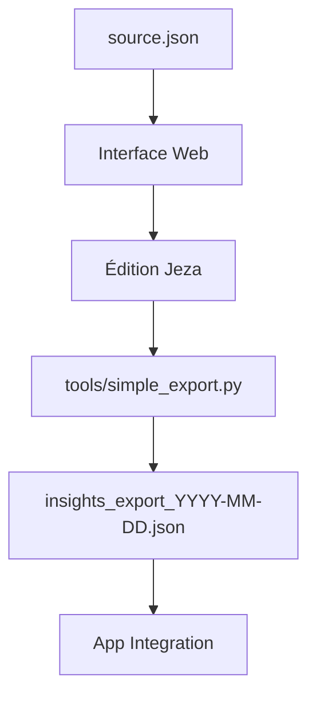

# 🏗️ Architecture - InsightsEditor

## Structure du Projet

```
insightsEditor/
├── source.json                     # Source unique : 178 insights validés
├── web/                            # Interface web
│   ├── index.html                  # Interface principale
│   ├── assets/                     # CSS, JS, images
│   ├── components/                 # Composants modulaires  
│   ├── data/                       # Données web
│   └── personas/                   # Assets personas
├── tools/                          # Scripts Python
│   ├── simple_export.py            # Export avec variants personas
│   ├── persona_config.py           # Configuration 5 personas
│   ├── validate_integrity.py       # Validation données
│   ├── requirements.txt            # Dépendances Python
│   └── archive/                    # Anciens scripts
├── data/                           # Données organisées
│   ├── current/                    # Fichiers actifs
│   └── archive/                    # Historique
├── archive/                        # Historique projet
└── node_modules/                   # Dépendances Sass
```

## Workflow



## Technologies

- **Frontend** : HTML, CSS (SCSS), JavaScript ES6+
- **Backend** : Python 3.8+
- **Serveur** : Python HTTP server
- **Build** : Sass

## Scripts Essentiels

### Export (`tools/simple_export.py`)
- Input : `source.json` (178 insights)
- Process : Génération 5 variants par insight
- Output : `insights_export_YYYY-MM-DD.json` (890 variants)

### Validation (`tools/validate_integrity.py`)
- Vérification structure données
- Validation format JSON
- Contrôle intégrité insights

### Configuration (`tools/persona_config.py`)
- Définition des 5 personas
- Paramètres génération variants
- Configuration styles linguistiques

## Format Données

### Source (`source.json`)
```json
{
  "insights": {
    "menstrual": [...],
    "follicular": [...], 
    "ovulatory": [...],
    "luteal": [...]
  }
}
```

### Export Final
```json
{
  "exportInfo": {
    "date": "2025-XX-XX",
    "totalInsights": 178,
    "totalVariants": 890
  },
  "menstrual": [{
    "id": "...",
    "baseContent": "...",
    "personaVariants": {
      "emma": "...",
      "laure": "...",
      "sylvie": "...", 
      "christine": "...",
      "clara": "..."
    }
  }]
}
```

## Commandes

```bash
# Démarrer serveur
cd web && python3 -m http.server 8000

# Export personas
python3 tools/simple_export.py

# Validation
python3 tools/validate_integrity.py source.json

# Build CSS
npm run sass
```

 